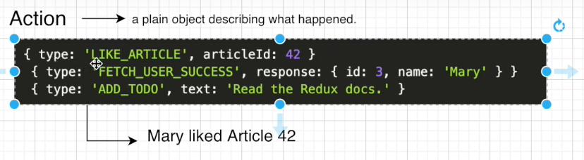
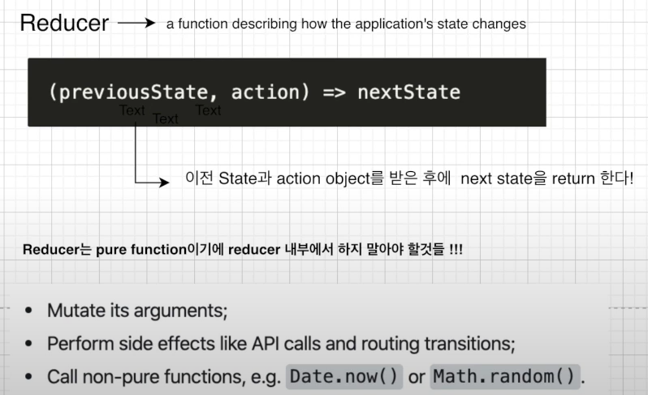
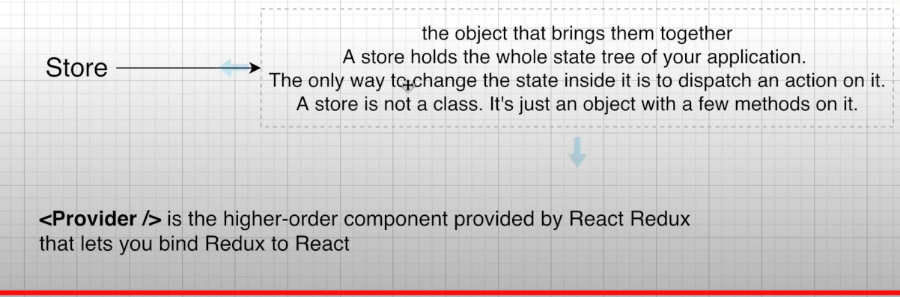
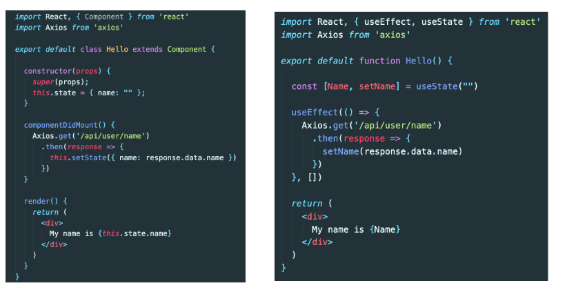
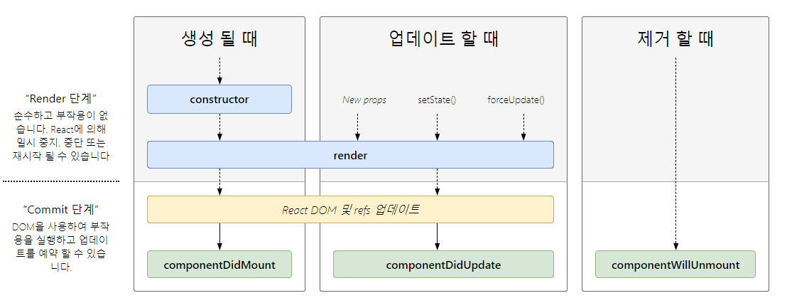

Create Project
---
1.해당 폴더 전이 후 package.json, node_modules 생성
> npm init

2.express추가 
> npm express --save

-> package.json에 dependency 추가된거 확인가능.

3.index.js 시작점 파일 생성
<br>참조:
https://expressjs.com/en/starter/hello-world.html

4.package.json 파일에 시작점 지정
"scripts": {
    "start": "node index.js",

5.terminal 에서 실행해보기
npm run start

Create MongoDB
---
1.https://www.mongodb.com
2.create free tier cluster 
3.메인화면>해당 클러스터 connect 버튼>user 추가, 같은 화면에 whilte list 에 자신의 IP추가
4.choose a connection method > connect your application >표시된 링크 copy 후 어디 메모해둠

5.mongoose 인스톨
>$ npm install mongoose --save

6.index.js 가서 mongoose 객체 불러다가 4에서 복사한 url 추가
>
const mongoose = require('mongoose')
mongoose.connect( url , {각종옵션})
  .then(() => console.log('MongoDB Connected....'))
  .catch(err => console.log(err))

MongoDB Model Schema
--
MongoDB Schema: document의, 기본값, validator 등의 구조를 정의한다.
<br>
MongoDB Model: database 를 위한 인터페이스를 제공한다.(레코드 CRUD 등)

1.model 폴더 생성> User.js생성<br>
-> schma 와 모델 생성 있으니 해당파일 참조


2.git폴더 생성
>git init

3파일들 스테이징
>git add .

4node_modules 섞여버렸으므로 삭제
>git rm --cached node_modules -r

5상태확인
>git status

6.깃허브 들어가서 리포지토리 생성 후 ssh설정 없으면 깃과 pc 에 설정
아래 링크 오지게 설명 잘 되있음<br>
https://docs.github.com/en/github/authenticating-to-github/connecting-to-github-with-ssh

7.깃 리포지토리와 연동
>git remote add origin 리포지토리 url

8.push
> git push -u origin master

BodyParser
---

npm install body-parser

const bodyParser = require('body-parser')

app.use(bodyParser.urlencoded({extended:true}));
app.use(bodyParser.json());

app.post('/register',(req, res)=>{

    //회원 가입 할때 필요한 정보들을 client 에서 가져오면
    //그것들을 데이터 베이스에 넣어준다.

    //body-parser 가 model 에 req.body 바로 맵핑해줌
    const user = new User(req.body);

NODE MON
---
소스 변경 자동반영해서 서버에 올려주는 툴

1.디펜던시 추가<br>
--save-dev는 local 에서 개발용으로 사용할때만 쓰겠다는 뜻 
>npm install nodemon --save-dev

2.package.json 수정 beckend는 약속아님 아무 이름이나

>script {
"beckend":"nodemon index.js"
}

3.nodemon 으로 기동
>$ npm run beckend

configFile 관리
===

1.몽고db URI 같이 PW가 다들어있는 코드는 git에 올릴수 없다.
```
//index.js
mongoose.connect(mongodbURI, option)
```

2.key.js파일 추가해서 prod/dev에 따라 config바꿀 수 있게 수정
```
//key.js
if(process.env.NODE_ENV === 'production') {
    module.exports = require('./prod');
} else {
    module.exports = require('./dev');
}
```
3.dev,prod js 양쪽다 mongoURI변수에 원하는값 export
```
module.exports = {
    mongoURI:'value'
}
```

4.아래와 같이 import 해서 사용한다. 
```
const config = require('./config/key')
mongoose.connect(config.mongoURI, option)
```

Bcript 를 통한 암호화
---
암호화 연습을 위해 pw항목을 암호화해본다.
https://www.npmjs.com/package/bcrypt

>npm install bcrypt --save

1.register route로 간다. 
<br>=>index.js post에 /register맵핑한 메소드  

2.MongoDB모델에 값이 맵핑되고 save 하기전에 암호화 해야되는걸 알수있다.

3.models/User.js로 이동
bcript 의 saltRound 사용해보자 (bcript 공식 doc참조)
=> 10자리 salt 생성해서 hash 해주겠다는 뜻
```
//mongodb schema 데이터를 model 에 반영하기 전에 전처리메소드 추가
userSchema.pre('save', function( next ){

}
```

10 자리 salt 를 이용해서 암호화 한다는 뜻
```
//bcript 임포트 
const bcrypt = require('bcrypt');
const saltRounds=10;

userSchema.pre('save', function( next ){
    var user = this;

    //pre는 모델에 값 반영하기전에 무조건 실행되므로
    //password항목이 변경됬을때로 한정
    if(user.isModified('password')){
        bcrypt.genSalt(saltRounds, function(err, salt) {
            if(err) return next(err)
            //plain pw, 생성된 salt, 후처리 콜백function
            bcrypt.hash(user.password, function(err, hash){
                //실패했으면 그냥 다음처리로 
                if(err) return next(err)
                //성공이면 password에 hash 설정
                user.password = hash
            })
        })
    }
})
```
> Salt 를 이용한 암호화<br>
조미료 소금처럼 원문에 가미해서 암호화한다는 뜻<br>
암호화할 때 원문을 복원 불가능한 해시로 변환하여 저장하며 <br>
비교처리도 해시로 비교<br>
->이때 원문 사이사이에 아스키코드를 벗어난 문자열이나 엉뚱한 랜덤 해시를 <br>
섞어서 문자를 미리 해시로 변환해놓고 해시자체를 비교하는 공격인 래인보우 <br>딕셔너리? 공격 방지하기 위한 수법 이기도함<br>


JWT json web token
---

토큰 생성을 위해서 JSONWEBTOKEN
라이브러리를 다운로드

>npm install jsonwebtoken --save

사이트 참조하여 토큰 생성<br>
https://www.npmjs.com/package/jsonwebtoken

쿠키에 토큰 넣기위해 의존성 추가
> npm install cookie-parser --save

React create-react app
---
예전에는 bable webpack 과 같이 구버전 브라우저들을 위해 
최신 자바스크립트 문법을 변환해주는 툴들의 설정이 어려웠음.

babel : 최신 자바스크립트 문법 지원않는 브라우저 들을 위해 
최신 ES6 -> ES5 로 변환해주는 툴

Webpack : 어플리케이션 확장에 따라 각종 라이브러리, 프레임워크 등 많은 모듈들을
번들로 묶어서 관리할 수 있게 해주는 툴이 등장함


하지만 이제 React create-react app로 한번에 시작할 수 있다.

.빼먹지 말것 
> npx create-react-app .

원래는 npm 으로 했었음.
>npm install create-react app

npm VS npx
---
npm: 
1. node.js프로젝트의 오픈소스 퍼블리싱 위한 온라인 리포지토리
2. 디팬던시 관리와 인스톨을 위한 Command-line utility  
역할: 패키지 매니징, 앱의 빌드
<h3>npm install locally</h3>
-g 옵션 안주면됨

<h3>npm install globally</h3>
-g 옵션
/usr/local/bin  on Linux<br>
%AppData%/npm   on windows<br>
node_modules에 패키지 저장

npx 는 npm registry에서 create-react-app 찾아서 다운로드 없이 실행시켜줌
disk space 낭비 줄이고 항상 최신버전 사용가능.


주의사항<br>
create-react-app 에 포함된 webpack은 src 안의 내용만 관리
public 폴더 안의 내용은 관리 안해주므로 이미지나 소스 등 파일은 되도록 src에 구성


Boiler Plate project 의 구조 
---
src<br>
_actions redux 위한 폴더<br>
_reducer redux 위한 폴더 <br>
components/views Page들<br>
components/views/Sections  해당 페이지 관련된 css, component 넣는다<br>
App.js  Routing관련 일<br>
Config.js 환경변수 저장<br>
hoc       higher Order Component의 약자. 권한, 역할에 의해 기능 실행하게 해주는역할<br>
utils  공통 유틸 <br>

component의 js 파일 생성 후 function 자동생성 단축키
>rfce 

App.js React Router Dom
---
페이지 이동시 React Router Dom활용하기로한다.

사용법
https://reacttraining.com/react-router/web/example/basic

>npm install react-router-dom --save

```
import to App.js

import {
  BrowserRouter as Router,
  Switch,
  Route,
  Link
} from "react-router-dom";
```

Route 에는 직접 <Component /> 하거나  Route component 속성으로  지정가능

```
        <Route exact path="/" component={LandingPage}>
        </Route>
        <Route path="/login">
          <LoginPage />
        </Route>
```

AXIOS (AJAX) 
---
Client -> Server 통신시 
엑시오스 AXIOS 라는 라이브러리 사용하기로한다

> npm install axios --save


CORS 이슈, Proxy 설정
---

현재 
express 로 구동하는 beckend는 포트 5000
react 는 포트3000

이 상태에서 axios로 리퀘스트 보내보면 CORS cross origin resource sharing 이슈 발생 
>Access to XMLHttpRequest at 'http://localhost:5000/api/hello' from origin 'http://localhost:3000' has been blocked by CORS policy: No 'Access-Control-Allow-Origin' header is present on the requested resource.

origin은 출처 즉, 두개의 도매인

여러가지 방법으로 해결 가능하지만 여기서는 proxy 사용
https://create-react-app.dev/docs/proxying-api-requests-in-development

>npm install http-proxy-middleware --save

Next, create src/setupProxy.js and place the following contents in it:
```
const { createProxyMiddleware } = require('http-proxy-middleware');
module.exports = function(app) {
  // example
  app.use(
    '/api',
    createProxyMiddleware({
      target: 'http://localhost:5000',
      changeOrigin: true,
    })
  );
};
```

Concurrently를 이용해서 프론트, 백서버 한번에 켜기
---
concurrently : 여러 commands를 동시에 작동시킬수 있게 해주는 tool

>npm install concurrently --save

> basepath 의 package.json 에 script추가
```
"dev": "concurrently \"npm run beckend\" \"npm run start --prefix client\""
```
여기서 run start 는 client안의 package.json 의 scrpit에 선언되 있는 start여야 하니까
--prifix client를 추가
>이제 프로젝트의 루트 폴더에서 npm run dev 로 둘다 실행가능


CSS Framework
---
ex)
1. Material UI
2. React Bootstrap
3. Semantic UI
4. Ant Design
5. Materialize

여기서는 Ant Design 사용<br>
https://ant.design/docs/react/introduce<br>
장점: enterprise 환경에도 걸맞는 굉장히 좋은 디자인, 사용간편<br>
단점: 용량이 크다.

>npm install antd --save

사용하려는 곳에 스타일시트 import
>import 'antd/dist/antd.css';


Redux란?
---
predictable state container
상태관리 라이브러리.

Props vs State

Props
1. shorthand for properties

2. Props are how components 
talk to each other.

3. props flow downwards 
from the parent component

4. Props are immutable(불변. 참조전용) 
from the child perspective
if you want to change that value ?
the parent should just 
change its internal state
```
<ChatMessages messages={messages} currentMember={member}>
```

1. parent component에서 
child component로 data를 
보내는게 아닌 
그 component 안에서 
데이터를 전달하려면?
State으로 
예를 들어서 검색 창에 글을 입력할떄
글이 변하는것은 state을 바꿈
2. State is mutable
3. State 이 변하면 re-render 된다.

```
state = {
    message: ' ',
    attachfile: undifined
}
```

<h3>Redux Data Flow = strict unidirectional data flow </h3>


Action<br>
무슨일이 일어났는지 알려줌 
fetch user success : response의 유저를 가져오는데 성공했다.


Reducer<br>
어떻게 어플리케이션의 state가 바뀌었는지 설명하는(기술하는) function


```
export default function(state, action) {
  switch (action.type) {
    case LOGIN_USER:
            return {...state}

    default:
        break;
  }

```
Store<br>
state tree 전체를 를 감싸는 object<br>
Store 은 클래스가 아니며 단지 몇가지 method를 갖는 object일 뿐이다.
Store 내부의 state 를 바꾸는 방법은 오직 action을 dispatch하는 것이다.



Redux UP
---

dependency related redux
1. redux
2. react-redux

-- redux 사용 보조해주는 dependency들<br>
Promise 형식과 function 형식을 dispatch받을때 도와주는 도구<br>
https://joshua1988.github.io/web-development/javascript/promise-for-beginners/#promise%EA%B0%80-%EB%AD%94%EA%B0%80%EC%9A%94
<br>
3. redux-promis<br>
4. redux-thunk

> npm install redux react-redux redux-promise redux-thunk --save

combineReducers 의 역할

>import { combineReducers } from 'redux';
Reducer는 스테이트가 어떻게 변하는지 기술해 줘서 기능별로 여러개의 Reducer를 나눠쓰게 되는데<br>
이러한 Reducer들을 하나로 합쳐주는 것<br>

React Hooks
---
 React Component 
|Class Component |Functional Component|
|------|-------|
|Provide more features|Provide less features|
|More Code|Less Code|
|More complex Code|Simpler Code|
|Slower Performance|Faster Performance|


Functional Component에서는 지원 안되는 기능이 많았기 때문에,
React 16.8이후로 Hook 기능 나옴
(주로 componentDidMount 와 같은 라이프사이클에 관련된 기능들)

<h2>꿀팁<h2>
... = 스프레드 오퍼레이터
이전에거 그대로 가져옴


